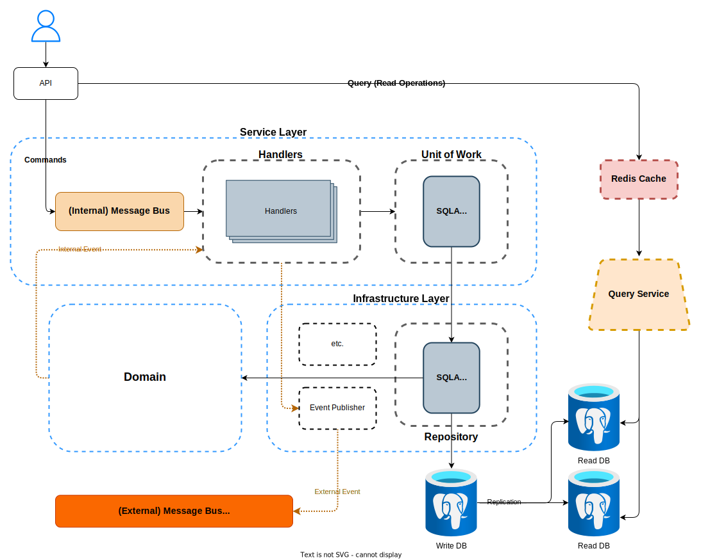

# Event-Driven with DDD eco energy test

Este proyecto implementa un avanzado **Servicio de facturación de energia** utilizando principios de **Diseño Orientado a Dominio (DDD)**, **Diseño Orientado a Pruebas (TDD)** y una **arquitectura impulsada por eventos**.

### Architecture



### TODO:

- [ ] Redis caching
- [ ] Testing
- [ ] Auth
- [ ] External Events publisher to RabbitMQ

## Stack Tecnológico

- **Python**
- **FastAPI**
- **RabbitMQ**
- **PostgreSQL**
- **Redis**
- **Docker**

### Code Architecture

```
envs/
sql/
├── bd.sql  # for create the database
├── seed.sql # data to prove the db
src/
├─ core/                    # settings and other configurations
├─ features/
│  ├─ allocation/
│  │  ├─ api/               # command (write) service
│  │  ├─ views/             # query (read) service
│  │  ├─ service_layer/     # message bus and handlers
│  │  ├─ domain/            # business logic
│  │  ├─ infrastructure/    # db, email and other adapters.
├─ main.py
tests/
├─ e2e/
├─ integration/
├─ unit/
```

## Configuración del Proyecto

Este proyecto utiliza **Docker Compose** para ejecutar la aplicación. Asegúrate de tener instalados **Docker** y **Docker Compose** en tu máquina.

### Instrucciones

1. **Descarga e instala Docker**: [Docker Installation Guide](https://docs.docker.com/get-docker/)
2. **Descarga e instala Docker Compose**: [Docker Compose Installation Guide](https://docs.docker.com/compose/install/)

### Para iniciar el entorno, ejecuta el siguiente comando:

```bash
docker-compose up -d
```

## Conexión a la Base de Datos

Después de ejecutar el comando para levantar los contenedores de Docker (`docker-compose up -d`), deberás conectarte a la base de datos PostgreSQL utilizando las siguientes credenciales:

- **POSTGRES_USER**: `postgres`
- **POSTGRES_PASSWORD**: `postgres`
- **POSTGRES_DB**: `postgres`
- **POSTGRES_HOST**: `postgres`

## Creación de Tablas

Una vez conectado a la base de datos, ejecuta el script SQL que se encuentra en `sql/db.sql` para crear las tablas necesarias. Puedes utilizar la herramienta de tu preferencia para conectarte a PostgreSQL, o ejecutar el archivo desde una terminal.

## Inserción de Datos de Prueba

Para agregar datos de prueba a la base de datos y verificar que el sistema funciona correctamente, utiliza el archivo `sql/seed.sql`, el cual contiene registros de ejemplo. Al igual que en el paso anterior, puedes ejecutar este archivo desde una herramienta de administración de base de datos o desde la terminal.

### Notas Importantes

- **Puertos**: Asegúrate de que los siguientes puertos no estén ocupados en tu máquina, ya que son utilizados por los contenedores:
  - **Backend**: `8000` (Accede a la documentación de la API en `http://localhost:8000`)
  - **Redis**: `6379`
  - **RabbitMQ**:
    - Cola: `5672`
    - Interfaz de administración: `15672`
  - **PostgreSQL**: `5432`
